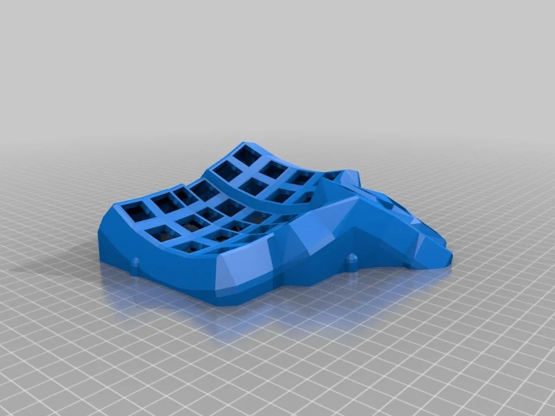
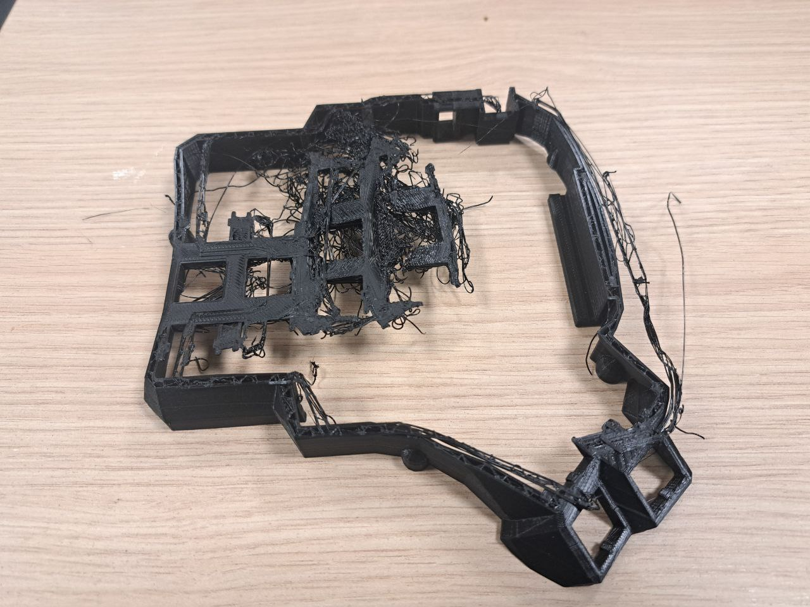
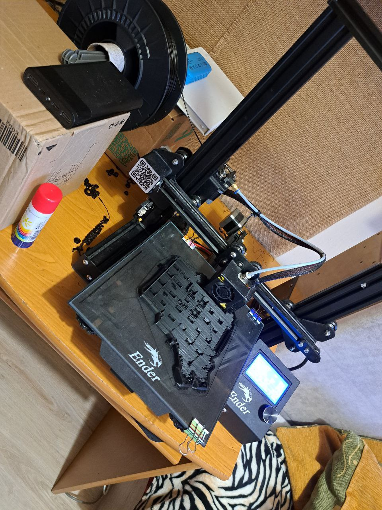
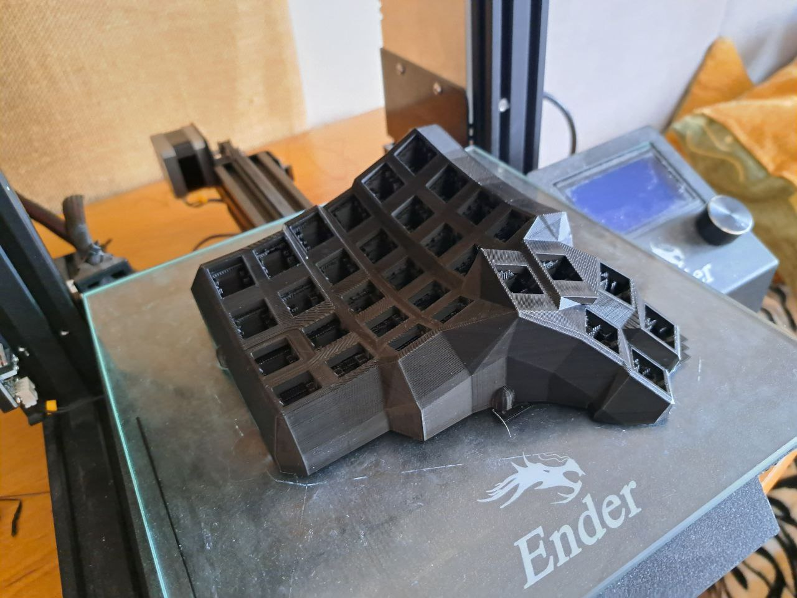
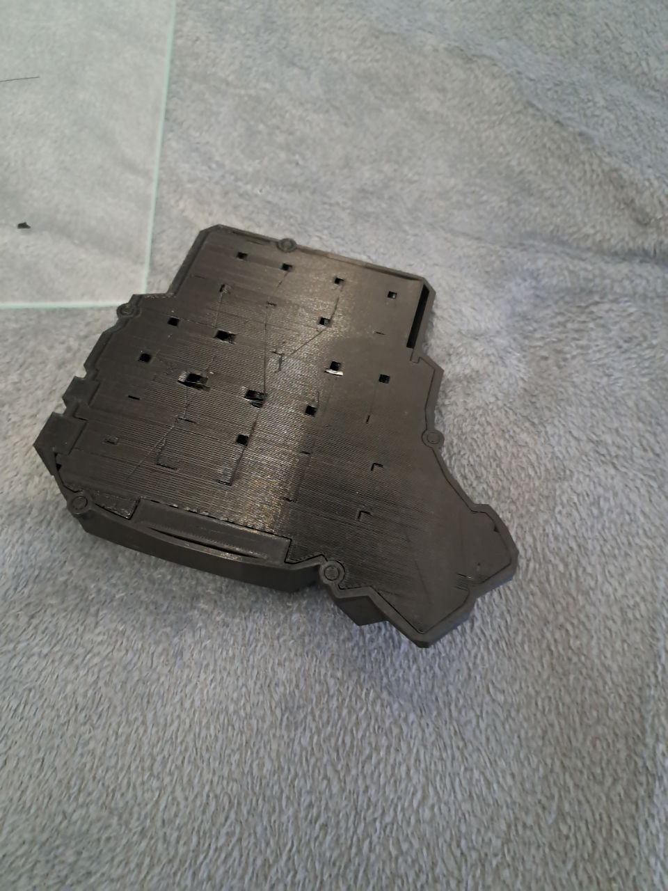
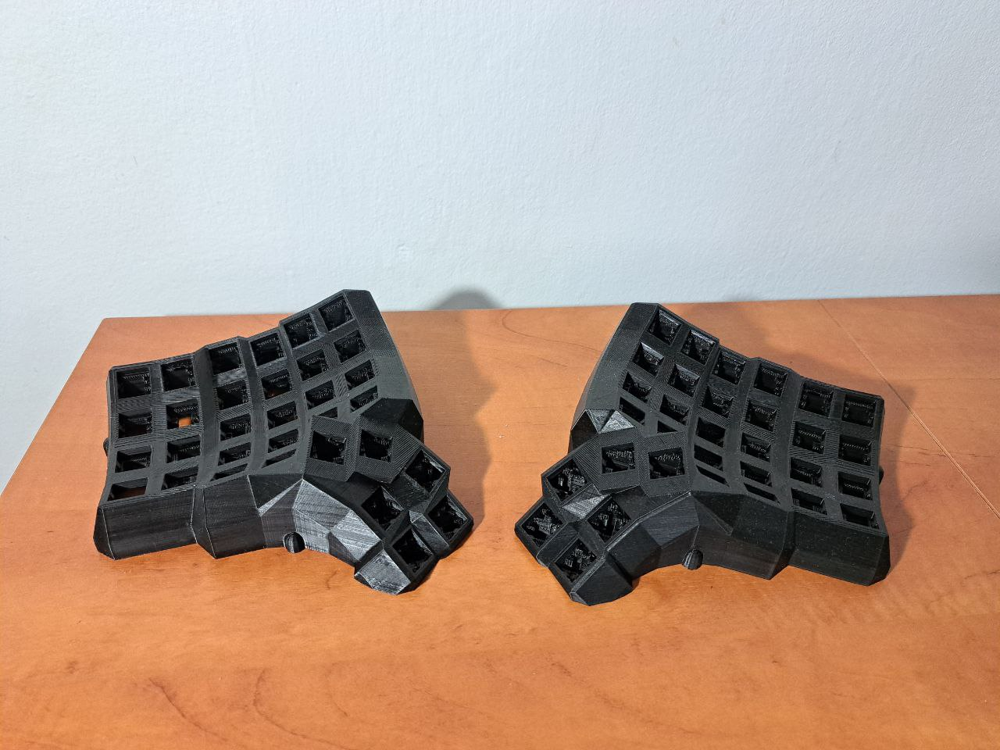

+++
title = "Byuilding Dactul-Manuform: Newbie in DIY edition."
date = 2024-02-25
category = "diy"
+++

I finally came to the idea that would be nice to have a proper hobby. Also inspired by different
kinds of keyboards I found [Dactyl-Manuform GitHub](https://github.com/abstracthat/dactyl-manuform)
project as a great idea for the self-build split keyboard as DIY project.

If you decide to build Dactul-Manuform as well I would recommend you to check github repo and as
well this blog helps me a
lot: [Complete idiot guide for building a dactyl manuform keyboard.](https://medium.com/swlh/complete-idiot-guide-for-building-a-dactyl-manuform-keyboard-53454845b065)

Another important thing - choosing a layout that you want to build. I select the 5x6 layout as
closest to the standard keyboard's layout. I assume it will be easier to adapt the layout as it is
my first try of a split keyboard.

## Purchase list

Following already existing description of Dactul-Manuform repo I've collected a list of materials
for this project:

1. [PLA PF Filament for 3D printer](https://allegro.pl/oferta/filament-pf-pla-1-75mm-1kg-czarny-9014078637)
   1,75 mm 1000 g (to print base plate) - ~12,5 USD
2. Switches - I'm totally newbie in keyboards nerd stuff, so I've picked up based on general not
   expensive switches
   recommendation [Gateron G Pro V3](https://aliexpress.com/item/1005006376024657.html?spm=a2g0o.order_list.order_list_main.47.21ef1c24Swjb0E&gatewayAdapt=glo2rus&sku_id=12000036949493895)
   70 pcs. - ~20.8 USD
3. [Cheapest keykaps on the whole AliExpress](https://www.aliexpress.com/item/1005005979935288.html?spm=a2g0o.order_list.order_list_main.5.21ef1c24Swjb0E) (
   Blue color probably was a mistake - will see. Anyway I'm planning to change them in the future
   when will know a little bit more about custom keyboards) - ~4.2 USD
4. 2 x Arduino pro
   micro [Micro ATMEGA32U4 Type-C](https://pl.aliexpress.com/item/32840365436.html?spm=a2g0o.order_list.order_list_main.52.21ef1c24243JSb&sku_id=12000016336828198&gatewayAdapt=glo2pol) - ~
   9.8 USD
5. [Female to Female 30sm Jumper Wires](https://www.aliexpress.com/item/1005004333197874.html?spm=a2g0o.order_list.order_list_main.37.21ef1c24Swjb0E) -
   40 pcs. -  ~1.9 USD
6. [Diodes 1N4148 DO-35](https://www.aliexpress.com/item/1005004333197874.html?spm=a2g0o.order_list.order_list_main.37.21ef1c24Swjb0E) -
   100 pcs. - ~1.6 USD
7. [Rj11 616E connectors](https://www.aliexpress.com/item/1005005654491710.html?spm=a2g0o.order_list.order_list_main.42.21ef1c24Swjb0E) (
   it will be used for linking 2 arduino with each other) - ~ 1.8 USD
8. [Brass Insert Nuts](https://www.aliexpress.com/item/1005006273964070.html?spm=a2g0o.order_list.order_list_main.11.21ef1c24Swjb0E)
   M3(OD 4mm) 50 pcs. - ~1.3 USD
9. [M3 Screw 5mm](https://www.aliexpress.com/item/1005002044837898.html?spm=a2g0o.order_list.order_list_main.16.21ef1c24Swjb0E) - ~
   1 USD
10. Phone cable to connect 2 part of keyboard - priceless coz it's provide own charm.

## 3D printing

A friend of mine provide a 3D printer (Ender 3 Pro) to me for printing the base. You are able to
find
prepared [STL's on the repo on github](https://github.com/abstracthat/dactyl-manuform/tree/master/things)
or on [thingiverse](https://www.thingiverse.com/thing:2666676/makes). On thingverse you are also
able to find bottom plates as well.

And coz I'm complete newbie in 3D printing first time sure first try was not so successful.

I came up with a question about what's wrong on Reddit and there was a bunch of good advice. But
seems the source of the issue was missing a Support Placement during Slicing STL. So basically you
can't
I first used UltiMaker Cura for slicing. But following Reddit advice I found a pretty full config
print a base without printing Support.
from one of the Redditors who have significant experience in printing Dactul.
Here the link to
the [full config](https://www.reddit.com/r/ErgoMechKeyboards/comments/1afrvbi/comment/kocbimk/?utm_source=share&utm_medium=web3x&utm_name=web3xcss&utm_term=1&utm_content=share_button).

I complete the slice and start printing. You should be patient coz it will take 22h 10min per each
base
plate.

#### 22 hours later...

Tiny life-hack: to detach the model from printer substrate => move it to refrigerator for 20
minutes. Love physics, under low-temperature detail, will be detached themselves.

And about Support Placement: be ready to spend time to remove it. Based on the config there are a
lot
of support layers.

#### Printing result

## Wiring

#### To be continuing...
